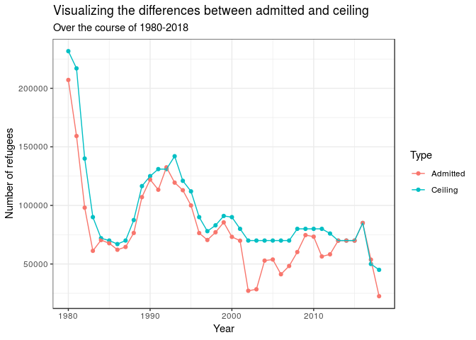
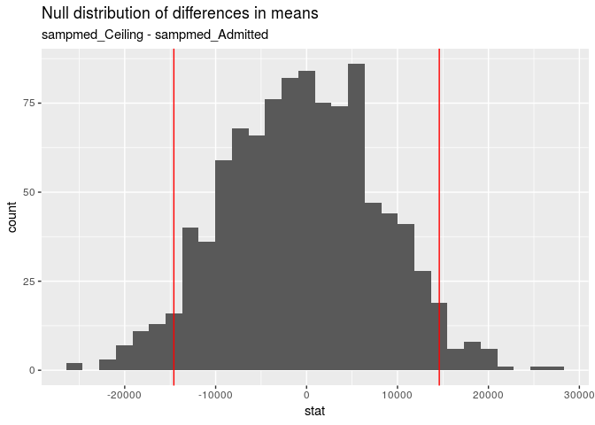

### Loading packages

    library(tidyverse)
    library(infer)
    library(openintro)

Looking at the data
===================

Originally, our data looked like this (showing only the first 10
results):

    refugee <- read.csv("refugee.csv")
    refugee %>%
      head(10)

    ##    Year  Ceiling Admitted
    ## 1  1980 231,700  207,116 
    ## 2  1981 217,000  159,252 
    ## 3  1982 140,000   98,096 
    ## 4  1983  90,000   61,218 
    ## 5  1984  72,000   70,393 
    ## 6  1985  70,000   67,704 
    ## 7  1986  67,000   62,146 
    ## 8  1987  70,000   64,528 
    ## 9  1988  87,500   76,483 
    ## 10 1989 116,500  107,070

We had 39 observations, representing the years from 1980 to 2018. The
variables in this dataset are `Year`, `Ceiling`, and `Admitted`.

1.  **Year** (*numerical*) - represents the years from 1980-2018

2.  **Ceiling** (*factor*) - represents the maximum amount of refugees
    accepted in those years.

3.  **Admitted** (*factor*) - represents the actual amount of refugees
    accepted in those years.

In order to look at this data and make better use of the observations, I
will turn the `Ceiling` and `Admitted` variables into numerical
variables and remove the commas. Then, I will manipulate the data using
the *mutate* and *filter* functions to double up on the observations and
create a new variable called `Type` that, instead of having ceiling and
admitted as variables, recognizes them as types with the numeric value
(that would have gone under each respective variable) under the new
variable `Toget`, or “together”. Thus, our new dataset looks like this
(showing only the first 10 results):

    refugee <- refugee %>%
      mutate(Ceiling = as.numeric(gsub(",", "", Ceiling)),
             Admitted = as.numeric(gsub(",", "", Admitted)))

    only1 <- refugee %>% 
      mutate(Toget = Ceiling,
             Type = "Ceiling") %>%
      select(Year, Toget, Type)

    only2 <- refugee %>%
      mutate(Toget = Admitted,
             Type = "Admitted") %>%
      select(Year, Toget, Type)

    together <- rbind(only1, only2)

    first_adm <- together %>%
      filter(Type == "Admitted") %>%
      head(5)
    first_ceil <- together %>%
      filter(Type == "Ceiling") %>%
      head(5)

    showing_first <- rbind(first_ceil, first_adm)
    showing_first

    ##    Year  Toget     Type
    ## 1  1980 231700  Ceiling
    ## 2  1981 217000  Ceiling
    ## 3  1982 140000  Ceiling
    ## 4  1983  90000  Ceiling
    ## 5  1984  72000  Ceiling
    ## 6  1980 207116 Admitted
    ## 7  1981 159252 Admitted
    ## 8  1982  98096 Admitted
    ## 9  1983  61218 Admitted
    ## 10 1984  70393 Admitted

Our new dataset `together` is now comprehensive and usable, in order to
conduct analysis.

Exploratory Data Analysis
=========================

Below, is a graph showing the changes in Ceiling and Admitted over the
course of all years:

    ggplot(data = together, mapping = aes(x = Year, y = Toget, color = Type)) +
      geom_point() +
      geom_line() +
      theme_bw() +
      labs(title = "Visualizing the differences between admitted and ceiling",
           subtitle = "Over the course of 1980-2018",
           x = "Year", y = "Number of refugees")

There have been significant changes since the 1980s and throughout the
entire time period.

There have been some instances where the amount of refugees admitted
went above the ceiling cap. Below, I showed which years those instances
occurred:

    refugee %>%
      mutate(difference = Ceiling - Admitted) %>%
      filter(difference <= 0)

    ##   Year Ceiling Admitted difference
    ## 1 1992  131000   132531      -1531
    ## 2 2017   50000    53716      -3716

What happened in 1992 and 2017?

1.  In 1992, according to the [Report of the United Nations High
    Commissioner for
    Refugees](https://www.unhcr.org/excom/unhcrannual/3ae68c860/report-united-nations-high-commissioner-refugees-1992.html),
    events that occurred in the Persian Gulf, the Horn of Africa and
    South-West Asia have posed unprecedented difficulties for people
    living in those areas, causing skyrocketing numbers of refugee
    applications for resettlement in the United States.

2.  In 2017, according to this overview of [U.S. Refugee Law and
    Policy](https://www.americanimmigrationcouncil.org/research/overview-us-refugee-law-and-policy),
    current President Donald Trump signed an executive order that
    suspended the entire U.S. refugee admissions program for 120 days,
    which caused significant decreases in refugee applications.
    Regardless, the cap set on refugees wasn’t strictly followed in 2018
    since those admitted didn’t go above the cap that year.

In being able to understand the influence the US has when setting caps
on how many people are allowed to enter the US as refugees, it would be
interesting and important to see if there a statistically significant
difference between the amount of refugees coming to the US and the cap
that’s set on them. The reason why is because, although refugees have to
send in an application from an overseas asylum officer and get it
approved, exceptions can be made, often going over the cap set, which we
saw it happen in 1992 and 2017. We’ll conduct a hypothesis test to look
at this.

Hypothesis Test: Is there a difference?
=======================================

### Do these data provide convincing evidence of a difference in refugees admitted for those that are type Ceiling and type Admitted during the years 1980s-2010s?

Let *m**e**a**n* represent the mean number of people admitted. Then,

*H*0 : *m**e**a**n**C**e**i**l**i**n**g* = *m**e**a**n**A**d**m**i**t**t**e**d*  
*H**A* : *m**e**a**n**C**e**i**l**i**n**g* ≠ *m**e**a**n**A**d**m**i**t**t**e**d*

Below, I calculated the observed sample difference:

    diff <- together %>%
      group_by(Type) %>%
      summarise(mean = mean(Toget))  %>%
      summarise(diff(mean)) %>%
      pull()

This value ended up being 1.459448710^{4}. Then, we create a null
distribution using 1000 permutations, in which we calculate the mean
difference and record that on this distribution.

    null_dist <- together %>%
      specify(response = Toget, explanatory = Type) %>%
      hypothesize(null = "independence") %>%
      generate(reps = 1000, type = "permute") %>%
      calculate(stat = "diff in means", order = c("Ceiling", "Admitted"))

Here, we have it visualized:

    ggplot(data = null_dist, aes(x = stat)) +
      geom_histogram() +
      geom_vline(xintercept = 14594.49, color = "red") +
      geom_vline(xintercept = -1 * 14594.49, color = "red") +
      labs(title = "Null distribution of differences in means",
           subtitle = "sampmed_Ceiling - sampmed_Admitted")

    ## `stat_bin()` using `bins = 30`. Pick better value with `binwidth`.

To determine the p-value, we calculate the proportion of permutation
samples that yield a difference in sample means of -1.459448710^{4} or
lower or 1.459448710^{4} or higher.

    null_dist %>%
      filter(stat >= diff | stat <= -diff)  %>%
      summarise(pvalue = (n() / 1000))

    ## # A tibble: 1 x 1
    ##   pvalue
    ##    <dbl>
    ## 1   0.07

This means that there isn’t a statistically significant difference
between those admitted and the cap that is set for all years. This is a
good thing since we’d expect that the cap set does a good job at
predicting how many people come to the U.S., but the implications behind
such analysis also suggest that this might be obvious since the U.S.
makes decisions based on policies and executive orders.
