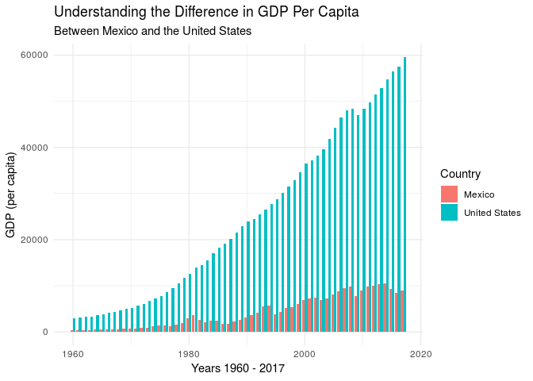
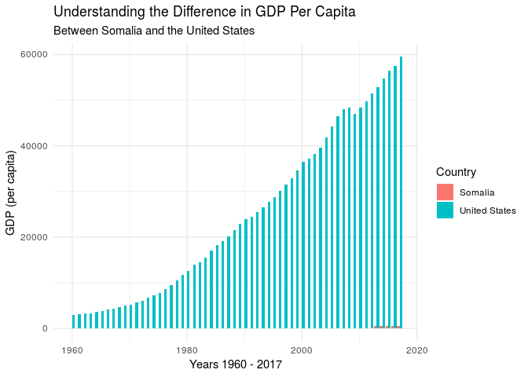
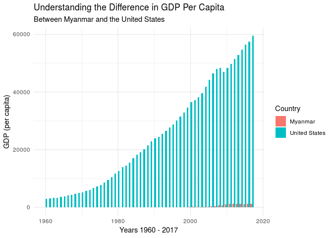
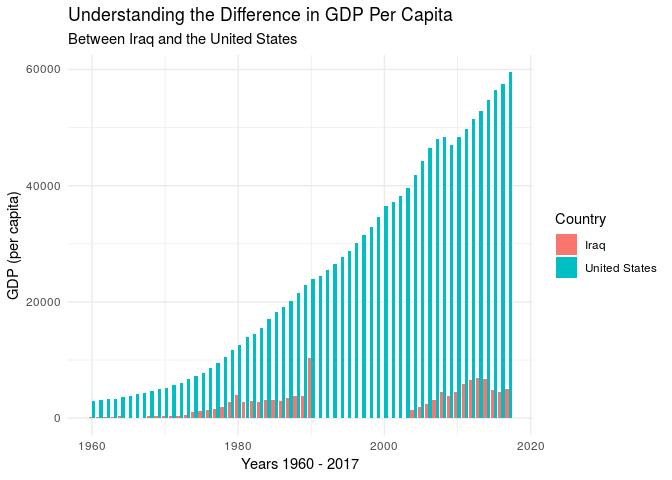
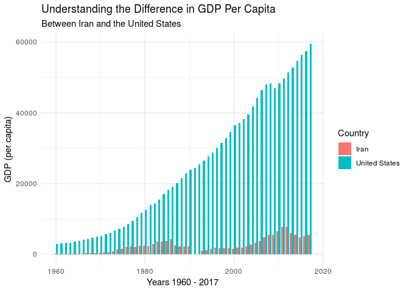

### Loading packages

    library(tidyverse)

    ## ── Attaching packages ─────────────────────────────────────────────────────────── tidyverse 1.2.1 ──

    ## ✔ ggplot2 3.1.1       ✔ purrr   0.3.2  
    ## ✔ tibble  2.1.1       ✔ dplyr   0.8.0.1
    ## ✔ tidyr   0.8.3       ✔ stringr 1.4.0  
    ## ✔ readr   1.3.1       ✔ forcats 0.4.0

    ## ── Conflicts ────────────────────────────────────────────────────────────── tidyverse_conflicts() ──
    ## ✖ dplyr::filter() masks stats::filter()
    ## ✖ dplyr::lag()    masks stats::lag()

Using the GDP data
------------------

Below, we will use GDP per capita data from the World Bank website:

    gdp <- read.csv("gdp.csv")

Here is the link for the information:
<a href="https://data.worldbank.org/indicator/ny.gdp.pcap.cd" class="uri">https://data.worldbank.org/indicator/ny.gdp.pcap.cd</a>

    gdp <- gdp %>%
      mutate(year_group = case_when(
        Year >= 1960 & Year < 1970 ~ "1960s",
        Year >= 1970 & Year < 1980 ~ "1970s",
        Year >= 1980 & Year < 1990 ~ "1980s",
        Year >= 1990 & Year < 2000 ~ "1990s",
        Year >= 2000 & Year < 2010 ~ "2000s",
        Year >= 2010 & Year < 2017 ~ "2010s",
      )) 

### Mexico vs US

    only_mex <- gdp %>%
      select(Mexico, Year, year_group) %>%
      mutate(mex_or_nah = "Mexico",
             toget = Mexico) %>%
      select(toget, Year, year_group, mex_or_nah)

    only_us <- gdp %>%
      select(United.States, Year, year_group) %>%
      mutate(mex_or_nah = "United States",
             toget = United.States) %>%
      select(toget, Year, year_group, mex_or_nah)

    us_and_mex <- rbind(only_us, only_mex)

    ggplot(us_and_mex, mapping = aes(x = Year, y = toget, fill = mex_or_nah)) +
      geom_bar(stat = "identity", position = position_dodge()) +
      theme_minimal() +
      labs(title = "Understanding the Difference in GDP Per Capita",
           subtitle = "Between Mexico and the United States",
           x = "Years 1960 - 2017",
           y = "GDP (per capita)",
           fill = "Country")

### Somalia

    only_som <- gdp %>%
      select(Somalia, Year, year_group) %>%
      mutate(som_or_nah = "Somalia",
             toget = Somalia) %>%
      select(toget, Year, year_group, som_or_nah)

    only_us_som <- gdp %>%
      select(United.States, Year, year_group) %>%
      mutate(som_or_nah = "United States",
             toget = United.States) %>%
      select(toget, Year, year_group, som_or_nah)

    us_and_som <- rbind(only_us_som, only_som)

    ggplot(us_and_som, mapping = aes(x = Year, y = toget, fill = som_or_nah)) +
      geom_bar(stat = "identity", position = position_dodge()) +
      theme_minimal() +
      labs(title = "Understanding the Difference in GDP Per Capita",
           subtitle = "Between Somalia and the United States",
           x = "Years 1960 - 2017",
           y = "GDP (per capita)",
           fill = "Country")

    ## Warning: Removed 53 rows containing missing values (geom_bar).

### Myanmar

    only_myan <- gdp %>%
      select(Myanmar, Year, year_group) %>%
      mutate(myan_or_nah = "Myanmar",
             toget = Myanmar) %>%
      select(toget, Year, year_group, myan_or_nah)

    only_us_myan <- gdp %>%
      select(United.States, Year, year_group) %>%
      mutate(myan_or_nah = "United States",
             toget = United.States) %>%
      select(toget, Year, year_group, myan_or_nah)

    us_and_myan <- rbind(only_us_myan, only_myan)

    ggplot(us_and_myan, mapping = aes(x = Year, y = toget, fill = myan_or_nah)) +
      geom_bar(stat = "identity", position = position_dodge()) +
      theme_minimal() +
      labs(title = "Understanding the Difference in GDP Per Capita",
           subtitle = "Between Myanmar and the United States",
           x = "Years 1960 - 2017",
           y = "GDP (per capita)",
           fill = "Country")

    ## Warning: Removed 40 rows containing missing values (geom_bar).

### Iraq

    only_iraq <- gdp %>%
      select(Iraq, Year, year_group) %>%
      mutate(iraq_or_nah = "Iraq",
             toget = Iraq) %>%
      select(toget, Year, year_group, iraq_or_nah)

    only_us_iraq <- gdp %>%
      select(United.States, Year, year_group) %>%
      mutate(iraq_or_nah = "United States",
             toget = United.States) %>%
      select(toget, Year, year_group, iraq_or_nah)

    us_and_iraq <- rbind(only_us_iraq, only_iraq)

    ggplot(us_and_iraq, mapping = aes(x = Year, y = toget, fill = iraq_or_nah)) +
      geom_bar(stat = "identity", position = position_dodge()) +
      theme_minimal() +
      labs(title = "Understanding the Difference in GDP Per Capita",
           subtitle = "Between Iraq and the United States",
           x = "Years 1960 - 2017",
           y = "GDP (per capita)",
           fill = "Country")

    ## Warning: Removed 16 rows containing missing values (geom_bar).

### Iran

    only_iran <- gdp %>%
      select(Iran..Islamic.Rep., Year, year_group) %>%
      mutate(iran_or_nah = "Iran",
             toget = Iran..Islamic.Rep.) %>%
      select(toget, Year, year_group, iran_or_nah)

    only_us_iran <- gdp %>%
      select(United.States, Year, year_group) %>%
      mutate(iran_or_nah = "United States",
             toget = United.States) %>%
      select(toget, Year, year_group, iran_or_nah)

    us_and_iran <- rbind(only_us_iran, only_iran)

    ggplot(us_and_iran, mapping = aes(x = Year, y = toget, fill = iran_or_nah)) +
      geom_bar(stat = "identity", position = position_dodge()) +
      theme_minimal() +
      labs(title = "Understanding the Difference in GDP Per Capita",
           subtitle = "Between Iran and the United States",
           x = "Years 1960 - 2017",
           y = "GDP (per capita)",
           fill = "Country")

    ## Warning: Removed 2 rows containing missing values (geom_bar).

Using the Mexico data:
----------------------

    mexico <- read.csv("mexico_data.csv")
